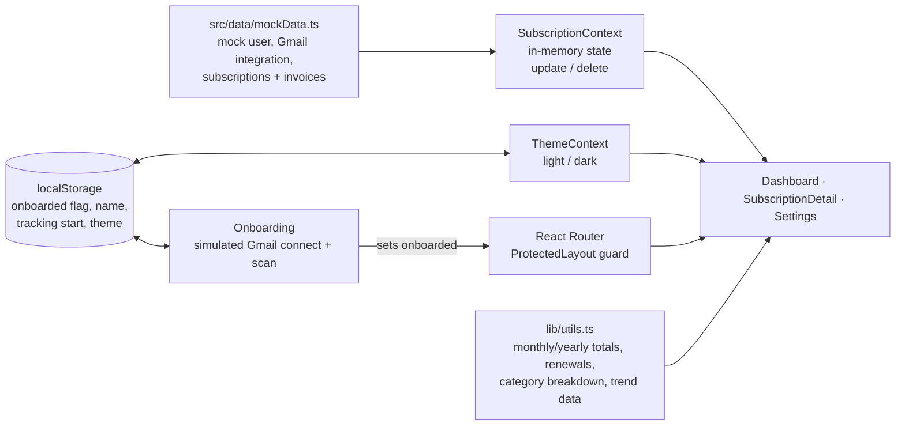

# Penny Drop

**Every subscription you pay for should be intentional: surfaced, contextual and cancellable.**

[Live demo](https://chanman22git.github.io/Penny-Drop/) · [Portfolio](https://chanman22git.github.io/builtbyinstincts/)

> **This is a UI prototype running on mock data.** It does not access Gmail or
> any email account. The "Connect Gmail" and inbox-scan steps are simulated with
> timers, and every subscription, invoice and price shown comes from
> `src/data/mockData.ts`. There is no backend.

## Executive summary

- **Problem:** subscriptions are spread across different cards and UPI mandates,
  renew automatically without warning, and pile up unnoticed until money is
  quietly lost on services nobody uses.
- **Concept:** a subscription-intelligence layer that would pull invoices from
  your Gmail, work out what you're actually paying for, and help you decide what
  to keep, pause or cancel.
- **What this repo is:** a clickable front-end prototype of that experience: an
  8-step onboarding with a simulated Gmail scan, a spending dashboard, and
  per-subscription detail pages with pricing tiers and alternatives.
- **Who it's for:** people who subscribe to everything and audit nothing. The
  mock data is set in India (INR pricing, UPI and card payment methods).
- **Status:** design prototype on mock data. It has no real Gmail integration, no
  invoice parsing, and no persistence beyond your browser's `localStorage`.
- **Technical highlights:** React 19, TypeScript, Vite, Tailwind CSS v4, Recharts
  and React Router 7, with light/dark theming. It deploys to GitHub Pages through
  GitHub Actions.

## Features

- **Onboarding (8 steps):** welcome → profile → connect Gmail (simulated) →
  tracking preferences (how far back to scan, rescan frequency) → invoice
  categories → animated inbox scan that "discovers" subscriptions → review and
  confirm → processing. Finishing sets a `localStorage` flag, and until then the
  app redirects to `/onboarding`.
- **Dashboard:**
  - metric cards for monthly spend, yearly spend, active subscriptions and
    renewals in the next 7 days
  - a spend and subscription-count trend chart with 3M / 6M / 1Y / All ranges
  - a spend-by-category chart
  - an upcoming-renewals widget
  - a subscriptions table with search, category and status filters, and sorting
    by cost, name, date or category
- **Subscription detail:** a service description, use cases and features,
  pricing plans, cheaper alternatives, payment details (method and last four
  digits), invoice history, and actions to pause, resume, cancel or delete. The
  actions change in-memory state only.
- **Settings:** a connected email integration (mock), notification preferences,
  currency and light/dark theme (the theme persists in `localStorage`), and a
  "Restart Onboarding" button to replay the flow.
- **Placeholders:** "Usage Analytics" is marked *Coming Soon*. The *Download Your
  Data* and *Delete All Data* buttons in Settings are not wired up.

## Architecture

Everything runs in the browser. State lives in React context and is seeded from
static mock data.



Edits made in the UI (pause, cancel, delete) live only in memory and reset when
the page reloads.

## Tech stack

| Layer | Technology |
|---|---|
| UI | React 19, TypeScript |
| Build | Vite 8, `@vitejs/plugin-react` |
| Styling | Tailwind CSS v4 (`@tailwindcss/vite`), class-based dark mode |
| Routing | React Router 7 (`BrowserRouter` with `basename` = Vite base) |
| Charts / dates / icons | Recharts, date-fns, lucide-react |
| Linting | ESLint 9 with typescript-eslint, react-hooks, react-refresh |
| Hosting | GitHub Pages via GitHub Actions |

## Project structure

```
Penny-Drop/
├── src/
│   ├── App.tsx                     # routes + onboarding guard
│   ├── data/mockData.ts            # all mock data (user, integrations, subscriptions)
│   ├── types/index.ts              # Subscription, Invoice, ServiceContext, ...
│   ├── context/                    # SubscriptionContext, ThemeContext
│   ├── lib/utils.ts                # currency formatting, totals, renewals, trend data
│   ├── pages/                      # Onboarding, Dashboard, SubscriptionDetail, Settings
│   └── components/
│       ├── dashboard/              # TrendChart, CategoryChart, RenewalWidget, SubscriptionTable
│       ├── layout/                 # PageLayout, Sidebar
│       └── ui/                     # MetricCard, StatusBadge
├── public/                         # favicon, icons
├── .github/workflows/deploy.yml    # GitHub Pages deploy
└── vite.config.ts                  # base: '/Penny-Drop/'
```

## Getting started

### Prerequisites

- Node.js 20 (the version used in CI) and npm

No environment variables or API keys are needed.

### Run locally

```sh
npm install
npm run dev        # Vite dev server
```

Vite is configured with `base: '/Penny-Drop/'`, so open the URL Vite prints (it
includes the `/Penny-Drop/` path). The first visit goes through onboarding. To
replay it, use **Settings → Restart Onboarding**, or clear the site's
`localStorage`.

### Scripts

```sh
npm run dev        # dev server
npm run build      # tsc -b && vite build (output in dist/)
npm run preview    # serve the production build
npm run lint       # eslint .
```

## Testing

There is no automated test suite yet. Type checking (`tsc -b`, run as part of
`npm run build`) and `npm run lint` are the current checks.

## Deployment

`.github/workflows/deploy.yml` runs on every push to `main` (and on manual
dispatch). It runs `npm ci` and `npm run build`, copies `dist/index.html` to
`dist/404.html` so deep links such as `/Penny-Drop/settings` load the app, and
deploys `dist/` to GitHub Pages.

## Roadmap and known limitations

This is a front-end prototype for validating the experience. The next steps
toward a working product would be:

- **Gmail integration:** OAuth and read-only invoice ingestion (replacing the
  simulated connect and scan).
- **Invoice parsing:** extracting service, amount, billing frequency and payment
  method from receipts automatically.
- **Backend and persistence:** stored user data. Today, UI edits are in-memory
  and reset on reload.
- **Service research:** generating the description, pricing tiers and
  alternatives per service instead of hand-written mock content.
- **Usage analytics** and cost-per-use (currently a *Coming Soon* card).
- **Working data controls** for the export and delete-all buttons in Settings.

Privacy statements in the Settings screen describe the intended design. The
prototype itself reads no email.

## Author

Built by **Chandru** ([BuiltByInstincts](https://chanman22git.github.io/builtbyinstincts/)),
Product & Data Builder in Bengaluru.
[LinkedIn](https://linkedin.com/in/chandrasekarv22)
